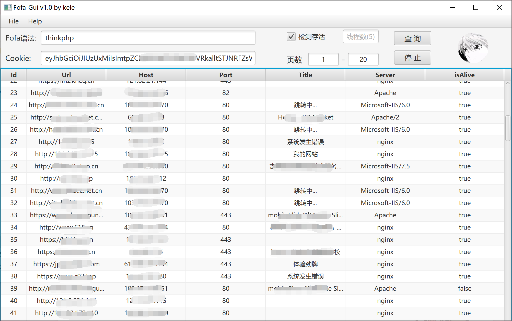
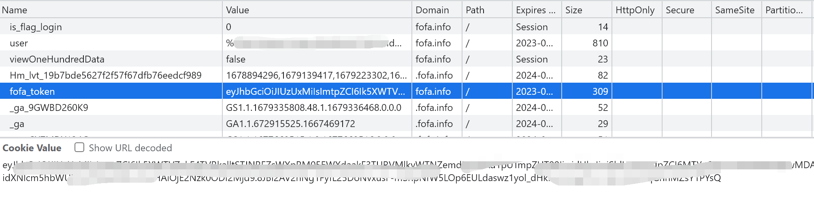

# Fofa-Gui

## About

此项目基于JavaFx构建可视化，项目的目的主要还是在于学习，所谓学而用之，学了不用就没意思了

主要还是目前大部分项目对于数据的抓取还是采用了API的形式，所以就有了利用爬虫对每个页面数据抓取的想法

- 一是为了学习：Java爬虫、GUI可视化编程
- 二是为了有用：……

## 功能

- 多线程批量爬取页面数据（默认使用5线程，最大支持30线程）
  - 在请求数量过多的时候，会报406，因此添加了重复请求的功能，如果请求失败或者状态码不为200，则会重复请求
- 对目标进行批量检测：采用异步对目标进行批量检测，速度快而准
- 支持结果导出：可以导出URL、IP以及导出全部信息到CSV文件中

## 使用

简单的啦，不必多说，运行环境JDK11+

- Cookie那里只需要找到Fofa中的：`fofa_token` 这部分内容添加就好啦

## 最后

虽然还是有点小八哥、不过够用了，有时间再考虑要不要优化